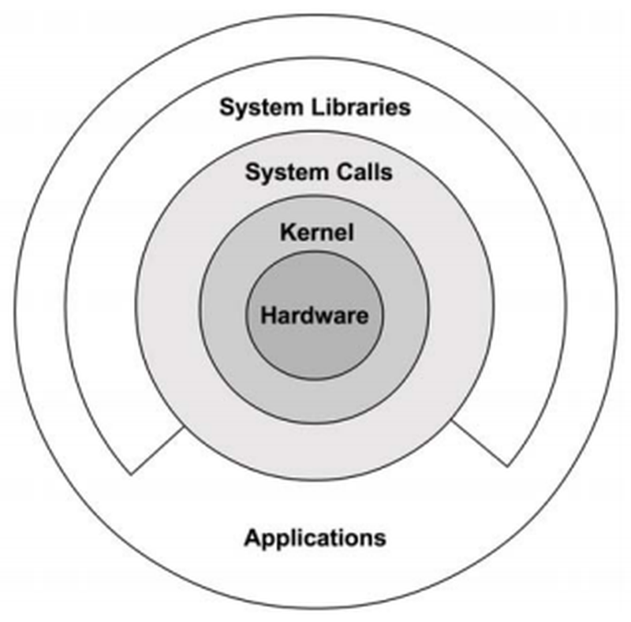
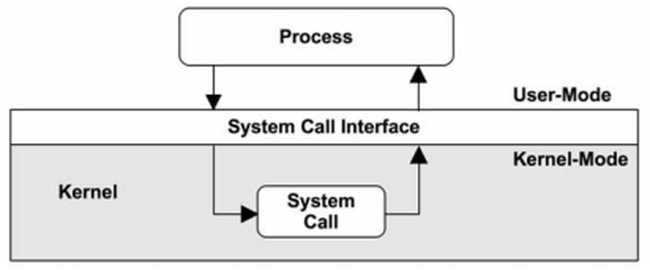
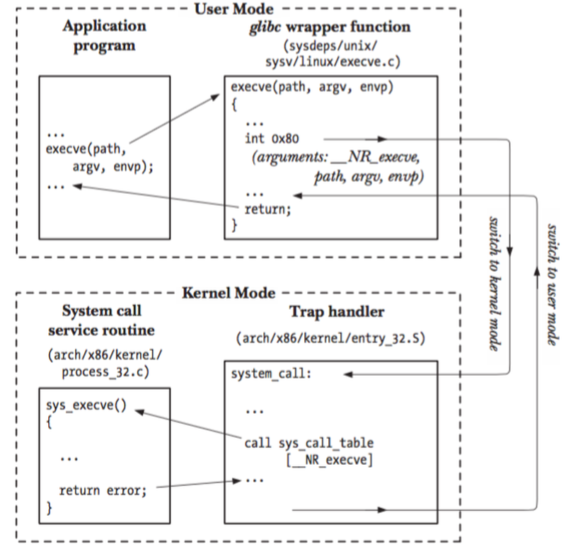
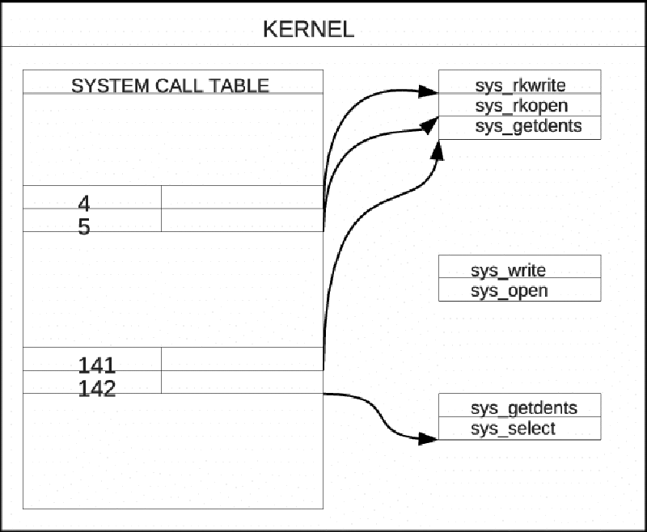
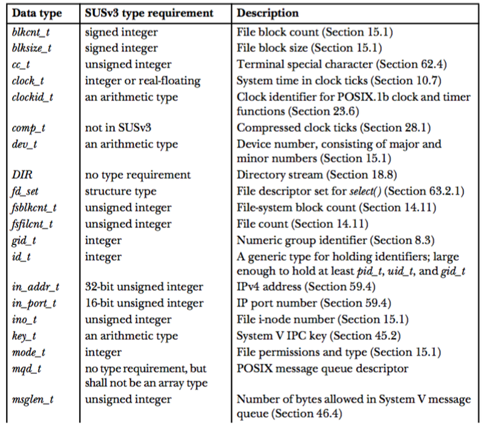
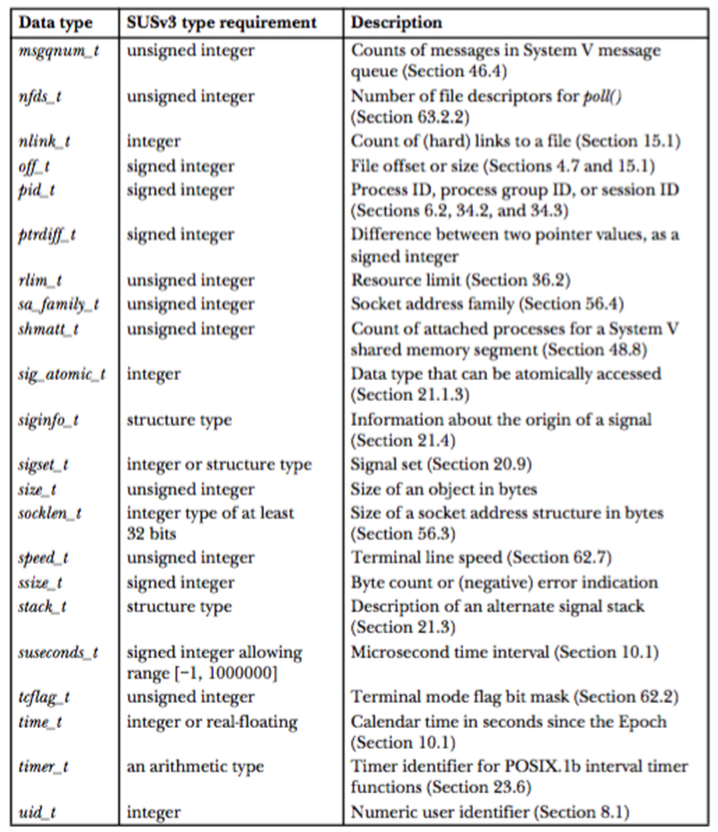

## Lecture 2 - System Programming Concepts
EE3233 Systems Programming for Engrs
Reference: M. Kerrisk, The Linux Programming Interface


___
## System Calls

* Entry point into kernel
* With System Calls, a process requests to kernel  to perform some action on the process’s behalf
  - Kernel makes a range of services (creating new process, performing I/O, creating a pipe for IPC) accessible to programs via the system call API





___
## System Calls - Cont'd

* A system call changes processor state from user mode to kernel mode
  * so that CPU can access protected kernel memory
* The set of system calls is fixed
* Arguments of system call are transferred from user space to kernel space (vice versa)




___
## System Calls - Cont'd

1. Application makes a system call by invoking a wrapper function in the C library

2. Wrapper function makes all arguments available to trap-handling routine
   * These arguments are passed to wrapper via the stack
   * Wrapper copies arguments to register (kernel requires them in registers)

3. Wrapper copies system call number into a specific CPU register (%eax)

4. Wrapper executes a trap machine instruction (int 0x80) : switch user mode &#8594; kernel mode

5. Kernel invokes its system_call() routine
located at “arch/x86/kernel/entry_32.S”
   * Saves register values onto the kernel stack
   * Checks the validity of the system call number
   * Invokes appropriate system call service routine
   * If the system call service routine has any arguments, it first checks their validity (addresses of pointers are valid)

6. Trap handler places the system call return value on the stack
   * If the system call service routine returned the error value, the wrapper function sets the global variable _errno_ using this value
   * Simultaneously returning to user mode




___
## System Calls - Cont'd

`execve()` : system call number 11 (_NR_execve)
   * in system_call_table vector, entry 11 contains the address of sys_execve(), service routine for this system call (sys_xxx() is a typical name in Linux)
   * “invoking the system call xyz()” 
     * means “calling the wrapper function that invokes the system call xyz()”




---
## Library Functions

* Functions that constitute standard C library
* Many library functions don’t use system calls
  * e.g., string manipulation functions
* Some library functions are layered on top of system calls
  * e.g., `fopen()` library function uses the `open()` system call
  * designed to provide caller friendly interface
    * e.g., `printf()` provides output formatting while `write()` just outputs a block of bytes
    * e.g., `malloc()` and `free()` performs various bookkeeping tasks while `brk()` system call does not


___
## Standard C Library (glibc)

* The most commonly used implementation on Linux is GNU C library (glibc)
* Version of glibc
```bash
$ /lib/x86_64-linux_gnu/libc.so.6
```
```bash
root@90dca184ddd2:/notebooks/temp# /lib/x86_64-linux-gnu/libc.so.6 
GNU C Library (Ubuntu GLIBC 2.23-0ubuntu10) stable release version 2.23, by Roland McGrath et al.
Copyright (C) 2016 Free Software Foundation, Inc.
This is free software; see the source for copying conditions.
There is NO warranty; not even for MERCHANTABILITY or FITNESS FOR A
PARTICULAR PURPOSE.
Compiled by GNU CC version 5.4.0 20160609.
Available extensions:
crypt add-on version 2.1 by Michael Glad and others
GNU Libidn by Simon Josefsson
Native POSIX Threads Library by Ulrich Drepper et al
BIND-8.2.3-T5B
libc ABIs: UNIQUE IFUNC
For bug reporting instructions, please see:
<https://bugs.launchpad.net/ubuntu/+source/glibc/+bugs>.
```


___
## Handling Errors from System Calls and Library Functions

* They return status value indicating success or fail
  * This status value should always be checked
  * Excluding this check to save time is a false economy


___
## Handling system call errors

Usually, an error is indicated by a return of -1

```C
fd = open(pathname, flags, mode);	/* system call to open a file */
if ( fd == -1 )
{
	/* Code to handle the error */
}
***
if ( close(fd) == -1 )
{
	/* Code to handle the error */
}
```

___
## Handling system call errors

* When a system call fails, it sets the global variable _errno_ to a positive value (specific error)
  * you should include <errno.h> header (declaration of _errno_)

```C
cnt = read(fd, buf, numbytes);
if (cnt == -1)
{
	if (errno == EINTR) {
		fprintf(stderr, “read was interrupted by a signal\n”);
	}
	else {
		/* Some other error occurred */
	}
}
```

/usr/include/asm-generic/errno-base.h


___
## Handling system call errors

* Common action after a failed system call is to print an error message based on the _errno_ value : use perror()
* `perror()` prints the string pointed by msg and message corresponding to the current value of _errno_

Prototype:
```C
#include <stdio.h>

void perror (const char *msg);
```

```C
fd = open (pathname, flags, mode);
if  ( fd == -1 )
{
	perror (“open”);
	exit (EXIT_FAILURE);
}
```


___
## System Data Type

* Most of the standard system data types have names ending in **_t**

```C
typedef  int  pid_t; 	    /* intended to represent process IDs */

pid_t mypid;
```


___
## System Data Type





___


