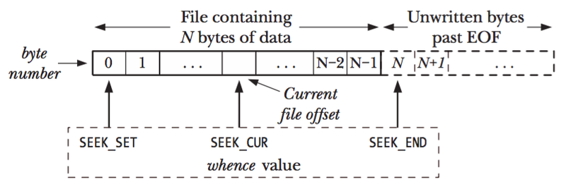
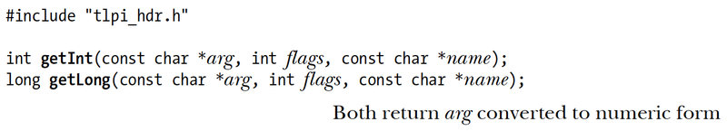
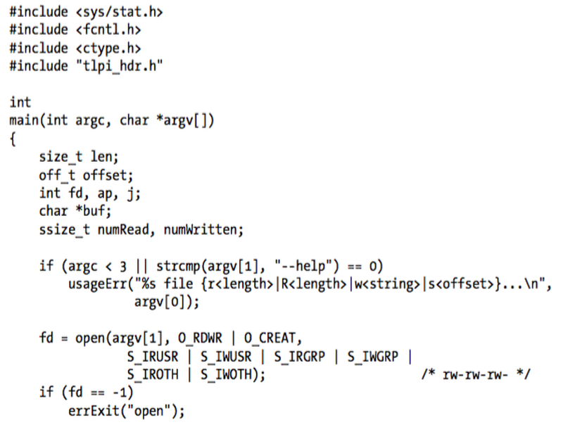
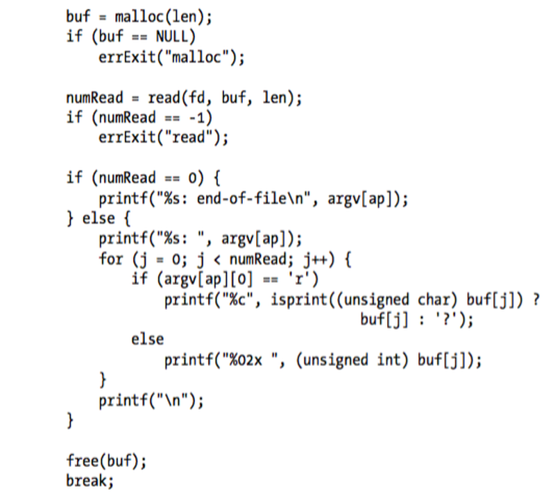
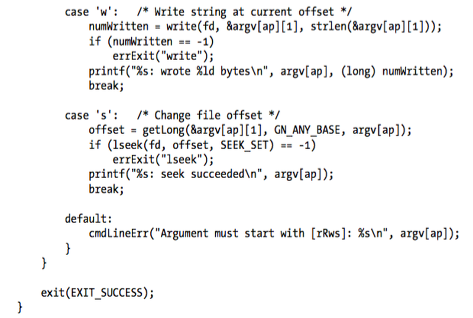
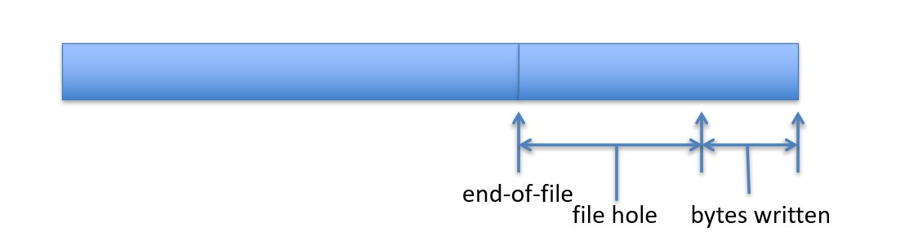

# Lecture 3 - File I/O
EE3233 Systems Programming for Engrs
Reference: M. Kerrisk, The Linux Programming Interface


___
## System Calls that we study 
* System calls used for performing file input and output
`open`
`close`
`read`
`write`

___
## File Descriptor
* All system calls for performing I/O refer to open files using a file descriptor (nonnegative integer)
* Each process has its own set of file descriptors
* Most programs are able to use 3 standard file descriptors
  * opened by shell for program before program starts
  * program inherits copies of shell’s fd

| File Descriptor | Symbolic Name | Description                               |
| --------------- | ------------- | ----------------------------------------- |
| 0               | `stdin`       | Standard Input, usually from the keyboard |
| 1               | `stdout`      | Standard Output, usually to the terminal  |
| 2               | `stderr`      | Standard Error, used for error messages   |


___
## fd = open(pathname, flags, mode)
* opens files identified by pathname
returns a file descriptor (fd) to refer to open file in subsequent calls
* If the file doesn’t exist, open creates it depending on flag bit
* mode specifies permissions to be placed on the file


___

## numread = read(fd, buffer, count)
* reads at most count bytes from open file referred to by fd
* stores them in buffer (address of memory buffer into which input is to be placed)
* returns number of bytes, or -1 on error
* If no further bytes could be read, `read()` returns 0


___
## numwritten = write(fd, buffer, count)
* writes up to count bytes from buffer to open file referred to by fd
* returns number of bytes written


___
## status = close(fd)
* is called after all I/O has been completed
* closes an open file descriptor freeing it for subsequent reuse by the process
* When a process terminates, all of its open file descriptors are automatically closed


___
## Practice
Example in C:
```bash
$ make copy.c
$ ./copy old_file  new_file
```

Example in Python:
```python
./copy.py
```
___
## Error Handling functions
These are not standard functions but helper functions provided in the book sample code.
* The `usageErr()`  function is used to diagnose errors in command-line argument usage
  * It takes an argument list in the style of `printf()`  and prints the string Usage: followed by the formatted output on standard error, and then terminates the program by calling `exit()`
* The `errExit()` function prints a message on standard error and terminates the program by calling `exit()`

___
The books version of copy.c
```C
#include <sys/stat.h>
#include <fcntl.h>
#include "tlpi_hdr.h"

#ifndef BUF_SIZE        /* Allow "cc -D" to override definition */
#define BUF_SIZE 1024
#endif

int
main(int argc, char *argv[])
{
    int inputFd, outputFd, openFlags;
    mode_t filePerms;
    ssize_t numRead;
    char buf[BUF_SIZE];

    if (argc != 3 || strcmp(argv[1], "--help") == 0)
        usageErr("%s old-file new-file\n", argv[0]);

    /* Open input and output files */
    inputFd = open(argv[1], O_RDONLY);/* O_CREAT is not specified, mode can be omitted */
    if (inputFd == -1)
        errExit("opening file %s", argv[1]);

    openFlags = O_CREAT | O_WRONLY | O_TRUNC;
    filePerms = S_IRUSR | S_IWUSR | S_IRGRP | S_IWGRP |
                S_IROTH | S_IWOTH;      /* rw-rw-rw- */
    outputFd = open(argv[2], openFlags, filePerms);
    if (outputFd == -1)  /* If an error occurs, open returns -1 */
        errExit("opening file %s", argv[2]);

    /* Transfer data until we encounter end of input or an error */
    while ((numRead = read(inputFd, buf, BUF_SIZE)) > 0)
        if (write(outputFd, buf, numRead) != numRead)
            fatal("couldn't write whole buffer");
    if (numRead == -1)
        errExit("read");

    if (close(inputFd) == -1)
        errExit("close input");
    if (close(outputFd) == -1)
        errExit("close output");

    exit(EXIT_SUCCESS);
}
```

| Access Flag | Description                        |
| ----------- | ---------------------------------- |
| `O_RDONLY`  | Open for read-only.                |
| `O_WRONLY`  | Open for write-only.               |
| `O_RDWR`    | Open for both reading and writing. |
| `O_APPEND`  | Append to the file on each write.  |
| `O_CREAT`   | Create file if it does not exist.  |
| `O_TRUNC`   | Truncate file to zero length.      |

Our copy.c
```C
#include <sys/stat.h>
#include <fcntl.h>
#include <stdio.h>
#include <stdlib.h>
#include <string.h>
#include <unistd.h>

#ifndef BUF_SIZE /* Allow "cc -D" to override definition */
#define BUF_SIZE 1024
#endif

int main(int argc, char *argv[])
{
    int inputFd, outputFd, openFlags;
    mode_t filePerms;
    ssize_t numRead;
    char buf[BUF_SIZE];

    if (argc != 3 || strcmp(argv[1], "--help") == 0)
    {
        fprintf(stderr, "usage error: %s old-file new-file\n", argv[0]);
        exit(EXIT_FAILURE);
    }

    /* Open input and output files */
    inputFd = open(argv[1], O_RDONLY); /* O_CREAT is not specified, mode can be omitted */
    if (inputFd == -1)
    {
        fprintf(stderr, "opening file %s", argv[1]);
        exit(EXIT_FAILURE);
    }

    openFlags = O_CREAT | O_WRONLY | O_TRUNC;
    filePerms = S_IRUSR | S_IWUSR | S_IRGRP | S_IWGRP |
                S_IROTH | S_IWOTH; /* rw-rw-rw- */
    outputFd = open(argv[2], openFlags, filePerms);
    if (outputFd == -1) /* If an error occurs, open returns -1 */
    {
        fprintf(stderr, "opening file %s", argv[2]);
        exit(EXIT_FAILURE);
    }

    /* Transfer data until we encounter end of input or an error */
    while ((numRead = read(inputFd, buf, BUF_SIZE)) > 0)
        if (write(outputFd, buf, numRead) != numRead)
        {
            fprintf(stderr, "couldn't write whole buffer");
            exit(EXIT_FAILURE);
        }

    if (numRead == -1)
    {
        fprintf(stderr, "read");
        exit(EXIT_FAILURE);
    }

    if (close(inputFd) == -1)
    {
        fprintf(stderr, "close input");
        exit(EXIT_FAILURE);
    }
    if (close(outputFd) == -1)
    {
        fprintf(stderr, "close output");
        exit(EXIT_FAILURE);
    }

    exit(EXIT_SUCCESS);
}
```

___
## Universality of I/O
* `open()`, `read()`, `write()`, and `close()` are used to perform I/O on all types of files including devices such as terminals

```bash
$ ./copy test test.old     	Copy a regular file
$ ./copy a.txt /dev/tty		Copy a regular file to this 
```

* Each file system and device driver should implement the same set of I/O system calls to achieve universality of I/O

___
## lseek()
* Kernel records a file offset (pointer) for each open file

```C
#include <unistd.h>

off_t lseek(int fd, off_t offset, int whence);
```
returns a new file offset if successful, or -1 on error

* this is the location at which the next read() or write() will commence
* file offset(a value in byte) is set to point to the start of file when opened
* Successive read() and write() calls progress sequentially through a file referred to by fd
* whence indicates the base point from which offset is to be interpreted

___
## lseek() - whence
* SEEK_SET
  * The file offset is set offset bytes from the beginning of the file
* SEEK_CUR
  * The file offset is adjusted by offset bytes relative to the current file offset
* SEEK_END
  * The offset is interpreted with respect to the next byte after the last byte of the file (size of file + offset)


___
## lseek()
* `curr = lseek(fd, 0, SEEK_CUR);`
  * current location of the file offset without changing it
* `lseek(fd, 0, SEEK_SET);`
  * start of file
* `lseek(fd, 0, SEEK_END);`
  * next byte after the end of the file
* `lseek(fd, -1, SEEK_END);`
  * last byte of file
* `lseek(fd, -10, SEEK_CUR);`
  * ten bytes prior to current location
* `lseek(fd, 10000, SEEK_END);`
  * 10001 bytes past last byte of file
* Calling `lseek()` simply adjusts kernel’s record of the file offset associated with a file descriptor

___
## Functions for the code
These are from the book
* `getInt()`, `getLong()`


  * The `getInt()` and `getLong()` functions convert the string pointed to by arg to an int or a long, respectively
  * If _arg_ doesn’t contain a valid integer string (i.e., only digits and the characters +  and - ), then these functions print an error message and terminate the program
  * _name_ argument should contain a string identifying the argument in arg
  * _flags_: we can select alternative bases for conversion

___
from book: fileio/seek_io.c





our example
```C
#include <sys/stat.h>
#include <fcntl.h>
#include <ctype.h>
#include <stdio.h>
#include <stdlib.h>
#include <string.h>
#include <unistd.h>

void errExit(const char *message) {
    perror(message);
    exit(EXIT_FAILURE);
}

int main(int argc, char *argv[])
{
    size_t len;
    off_t offset;
    int fd, ap, j;
    unsigned char *buf;
    ssize_t numRead, numWritten;

    if (argc < 3) {
        fprintf(stderr, "Usage: %s file {r<length>|R<length>|w<string>|s<offset>}...\n", argv[0]);
        exit(EXIT_FAILURE);
    }

    fd = open(argv[1], O_RDWR | O_CREAT,
                S_IRUSR | S_IWUSR | S_IRGRP | S_IWGRP |
                S_IROTH | S_IWOTH);  /* rw-rw-rw- */
    if (fd == -1)
        errExit("open");

    for (ap = 2; ap < argc; ap++) {
        switch (argv[ap][0]) {
        case 'r':
        case 'R':
            len = strtol(&argv[ap][1], NULL, 10);

            buf = malloc(len);
            if (buf == NULL)
                errExit("malloc");

            numRead = read(fd, buf, len);
            if (numRead == -1)
                errExit("read");

            if (numRead == 0) {
                printf("%s: end-of-file\n", argv[ap]);
            } else {
                printf("%s: ", argv[ap]);
                for (j = 0; j < numRead; j++) {
                    if (argv[ap][0] == 'r')
                        printf("%c", isprint(buf[j]) ? buf[j] : '?');
                    else
                        printf("%02x ", buf[j]);
                }
                printf("\n");
            }

            free(buf);
            break;

        case 'w':
            numWritten = write(fd, &argv[ap][1], strlen(&argv[ap][1]));
            if (numWritten == -1)
                errExit("write");
            printf("%s: wrote %ld bytes\n", argv[ap], (long) numWritten);
            break;

        case 's':
            offset = strtol(&argv[ap][1], NULL, 10);
            if (lseek(fd, offset, SEEK_SET) == -1)
                errExit("lseek");
            printf("%s: seek succeeded\n", argv[ap]);
            break;

        default:
            fprintf(stderr, "Argument must start with [rRws]: %s\n", argv[ap]);
            exit(EXIT_FAILURE);
        }
    }

    if (close(fd) == -1)
        errExit("close");

    exit(EXIT_SUCCESS);
}
```
___
## Practice
Input
```bash
$ touch tfile					    Create new empty file		
$ ./seek_io tfile s100 wabcdef		Seek to offset 100, write “abcdef”
```
Output
```bash
s100: seek succeeded
wabcdef: wrote 6 bytes
```
* _**s**offset_: seek to byte offset from the start of the file
* _**r**length_: read length bytes from the file, starting at the current file offset, and display 
	      them in text form
* _**R**length_: read length bytes from the file, starting at the current file offset, and display
	       them in hexadecimal
* _**w**str_: write the string of characters specified in str at the current file offset

Input:
```bash
$ ./seek_io tfile s100 r3
```
Output:
```bash
s100: seek succeeded
r3: abc
```
___
## File holes
* file hole : space in between the previous end of file and the newly written bytes



* The bytes in a hole exist, and reading from the hole returns a buffer of bytes containing 0 (null bytes)
* File holes don’t take up any disk space
* 21

