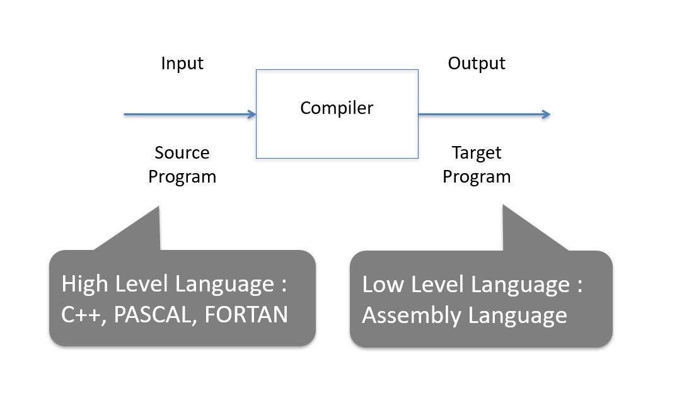
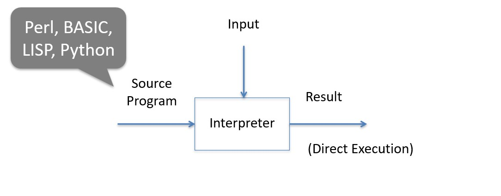
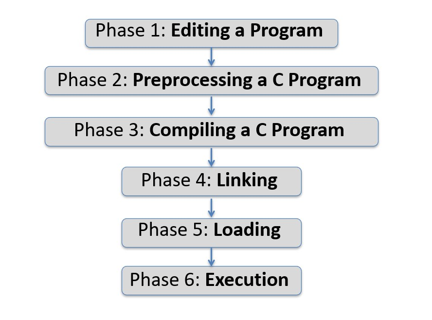
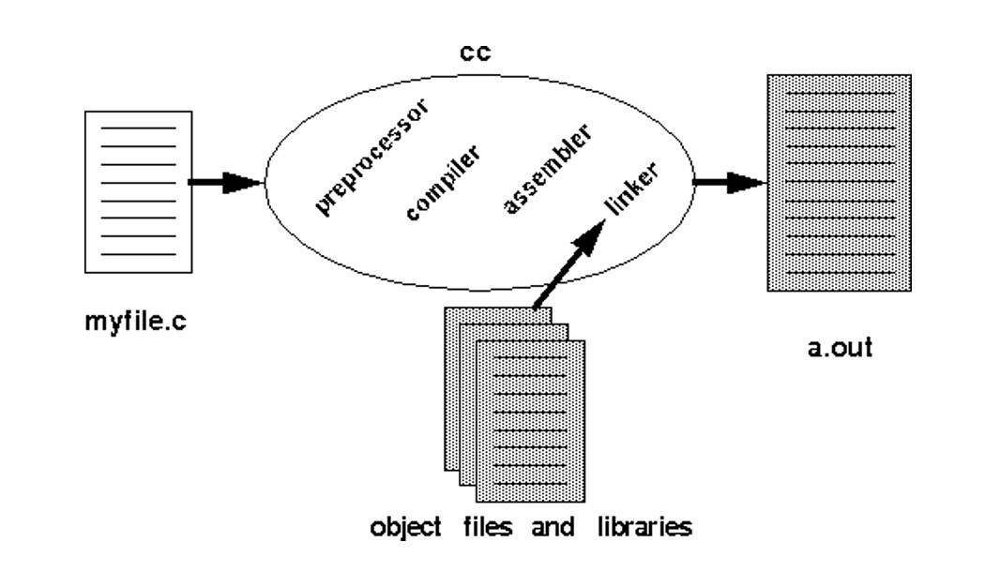
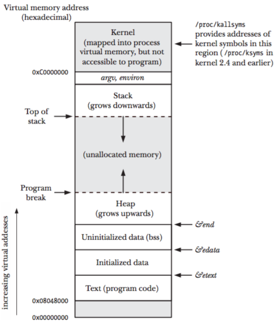
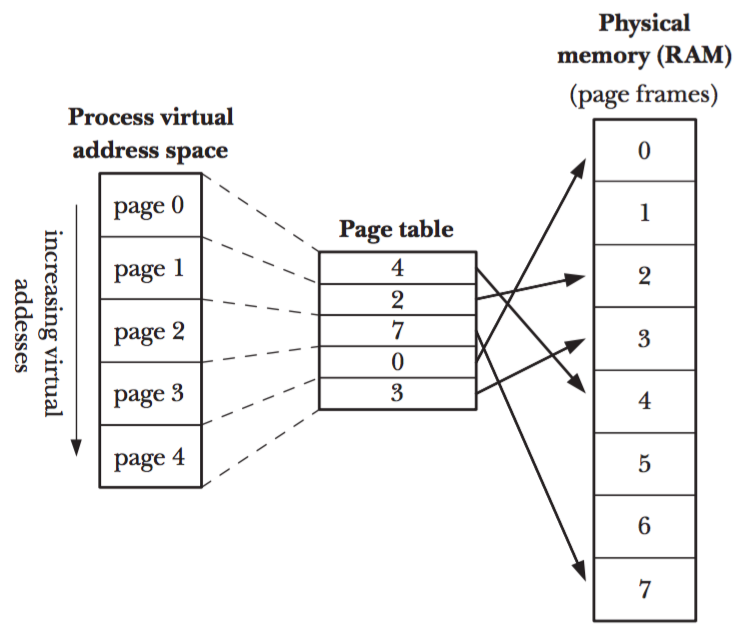
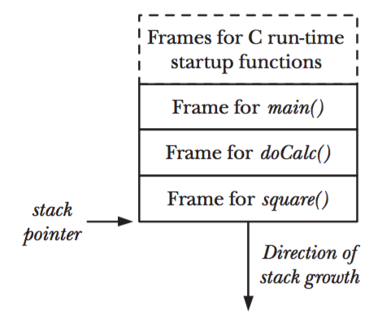
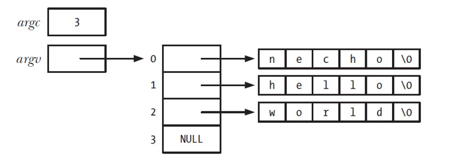

### Lecture 4 - Processes
EE3233 Systems Programming for Engrs
Reference: M. Kerrisk, The Linux Programming Interface


___
### Languages

* Machine Languages
  * Computer can directly understand its own machine language (machine code) defined by H/W architecture
  * Generally consists of 0s and 1s
* Assembly Languages
  * English-like abbreviations to represent elementary operations
  * Assemblers: translator programs to convert assembly-language programs to machine language

| Address |      | Machine Language |      |      |      | Assembly Language         |
| ------- | ---- | ---------------- | ---- | ---- | ---- | ------------------------- |
| 0000    | 0000 | 0000             | 0000 | 0000 | 0000 | TOTAL .BLOCK 1            |
| 0000    | 0001 | 0000             | 0000 | 0000 | 0010 | ABC      .WORD 2          |
| 0000    | 0010 | 0000             | 0000 | 0000 | 0011 | XYZ      .WORD 3          |
| 0000    | 0011 | 0001             | 1101 | 1101 | 0001 | LOAD     REGD, ABC        |
| 0000    | 0100 | 0001             | 1110 | 0000 | 0010 | LOAD     REGE, XYZ        |
| 0000    | 0101 | 0101             | 1111 | 1101 | 1110 | ADD      REGF, REGD, REGE |
| 0000    | 0110 | 0010             | 1111 | 0000 | 0000 | STORE    REGF, TOTAL      |
| 0000    | 0111 | 1111             | 0000 | 0000 | 0000 | HALT                      |

___
### Compiler



___
### Interpreter

* Interpreter is a kind of translator which produces the result directly when the source language and data is given to it as input



___
### Compiler vs. Interpreter

* Compiler
  * Object code needs to be generated
    * takes extra preparation time before program run
  * Assembling and Linking are needed
	* takes extra preparation time before program run
  * No more analysis is required once it is compiled
    * runs very quickly
* Interpreter
  * Object code needs NOT to be generated
    * starts right away
  * Assembling and Linking are NOT needed
    * saves time in assembling and linking
  * Source program should be interpreted and analysis of source program is required every time it is to be executed
    * runs slowly

___
### Typical C Development Environment



___
### Typical C Development Environment

* Phase 1: Editing a Program
  * Integrated Development Environments (IDEs): provide tools that support S/W-development process (editing, debugging, etc.)
  * e.g., MS Visual Studio, VS Code, NetBeans, Eclipse, Apple’s Xcode

* Phase 2: Preprocessing a C Program
  * _Preprocessing directives_ indicate that certain manipulations are to be performed on the program **before** compilation
  * e.g., include text file to be compiled, and perform various text replacement:

  ```C
  #include “filename”
  #define PI 3.14159
  ```

* Phase 3: Compiling a C Program
  * creates object code and stores it on disk
* Phase 4: Linking
  * A linker links object code with libraries and creates an executable file
  * If the program compiles and links correctly, an executable image is produced

* Phase 5: Loading
  * Before a program can be executed, it must first be placed in memory
  * Loader takes executable image from disk and transfer it to memory
  * Additional components from shared libraries that support the program are also loaded
* Phase 6: Execution
  * Computer executes the program one instruction at a time
  * Modern computer can execute several instructions in parallel

___
### Internals of cc




___
### Process ID and Parent Process ID

* Each process has a process ID (PID)
  * a positive integer that uniquely identifies the process on the system
* PIDs are used and returned by a variety of system calls
  * `kill()` allows caller to send a signal to a process with a specific process ID

```C
#include <unistd.h>

pid_t getpid(void);	// Always successfully returns PID of caller
```

___
### Process ID and Parent Process ID

* The maximum PID value in modern Linux systems can go up to \(4,194,304\), in older kernel versions, this limit was \(32,767\). This change has been in place since Linux kernel version 2.5.34.
*  When the maximum PID is reached, the PID counter does reset to search for the next available lower PID. However, the reset usually starts at a lower value, often around 100 or 200, not necessarily 300.
* PIDs below the reset value are generally reserved for system processes and daemons.

___
### Process ID and Parent Process ID

* Each process has a parent – the process that created it

```C
#include <unistd.h>

pid_t getppid(void); // Always successfully returns PID of parent of caller
```


* The parent of each process has its own parent, and so on, going to process 1, init (ancestor of all processes)
* If a child process becomes orphaned then it is adopted by init process

___
### Memory Layout of a Process

The memory allocated to each process is composed of a number of parts referred to as segments
 * text segment
 * initialized data segment
 * uninitialized data segment
 * stack
 * heap

___
### text segment

* contains machine-language instructions of the program run by the process
* ‘read-only’ so that a process doesn’t accidentally modify its own instruction via a bad pointer value

___
### Initialized Data Segment

* contains global and static variables that are explicitly initialized
* Values of these variables are read from the executable file when the program is loaded into memory

___
### Uninitialized Data Segment

* contains global and static variables that are not explicitly initialized
* Before starting the program, the system initializes all memory in this segment to 0
* It is not necessary to allocate space for the uninitialized data
  * Instead, the executable merely needs to record the location and size required for the uninitialized data segment
  * this space is allocated by the program loader at run time

___
### Stack

* dynamically growing and shrinking segment containing the stack frame
  * One stack frame is allocated for each called function
  * A frame stores the function’s local variables (automatic variable), arguments, and return value

___
### Heap

* Memory for variables can be dynamically allocated at run time

___
Typical memory layout of a process 
on Linux/x86032



___
```C
#include <stdio.h>
#include <stdlib.h>

char globBuf[65536]; /* Uninitialized data segment */
int primes[] = { 2, 3, 5, 7 }; /* Initialized data segment */

static int square(int x)  /* Allocated in frame for square() */
{
    int result; /* Allocated in frame for square() */

    result = x * x;
    return result; /* Return value passed via register */
}

static void doCalc(int val) /* Allocated in frame for doCalc() */
{
    printf("The square of %d is %d\n", val, square(val));

    if (val < 1000) {
        int t; /* Allocated in frame for doCalc() */

        t = val * val * val;
        printf("The cube of %d is %d\n", val, t);
    }
}

int main(int argc, char *argv[]) /* Allocated in frame for main() */
{
    static int key = 9973; /* Initialized data segment */
    static char mbuf[10240000]; /* Uninitialized data segment */
    char *p; /* Allocated in frame for main() */

    p = malloc(1024);  /* Points to memory in heap segment */

    doCalc(key);

    exit(EXIT_SUCCESS);
}
```
proc/mem_segments.c

___
### 3 Global Symbols by C

* C program environment on most UNIX (including Linux) provides three global symbols
  * etext : end of the program text segment
  * edata : end of the initialized data segment
  * end : end of the uninitialized data segment

___
### Virtual Memory Management

* Aim of this technique : Efficient use of both CPU and RAM by exploring locality
  * Spatial locality
  * Temporal locality
* Spatial locality
  * tendency of a program to reference memory addresses that are near those that were recently accessed
* Temporal locality
  * tendency of a program to access the same memory addresses in the near future that it accessed in the recent past
* It is possible to execute a program while maintaining only part of its address space in RAM

___

### Virtual Memory Management

* Split virtual memory into pages
* Correspondingly, RAM is divided into a series of page frames of same size
  * Only some of pages of a program need to be resident in physical memory page frames (resident set)
  * Copies of the unused pages of a program are maintained in the swap area (a reserved area of disk space) and loaded into physical memory only as required
* When a process references a page that is not currently resident in physical memory, a **page fault** occurs : the kernel suspends execution of the process while the page is loaded from disk into memory

___
Overview of virtual memory



___
### Page Table

* The kernel maintains a page table for each process
* describes location of each page in process’s virtual address space
  * each entry in the page table either indicates location of a virtual page in RAM
  * or indicates that it currently resides on disk
* Not all address ranges in the process’s virtual address space require page-table entries
* Typically, large ranges of the potential virtual address space are unused : not necessary to maintain corresponding page-table entries
* When a process tries to access an address not in page-table, it receives a SIGSEGV signal

___
### Process’s range of valid virtual address

* can change over its lifetime
  * as the stack grows downward beyond limits previously reached
  * when memory is allocated or deallocated on the heap

___
### Separation of memory space

* Advantage of separating the virtual address space from the physical address space of RAM
  * Processes are isolated from one another and from the kernel : one process can’t read or modify the memory of another process or kernel by having the page-table entries for each process point to distinct sets of physical pages in RAM
  * two or more processes can share memory : kernel make this by having page-table entries in different processes refer to the same pages of RAM
    Memory sharing occurs in two circumstances:
    1. Multiple processes executing the same program can share a single (read-only) copy of the program code
    2. Processes can use `shmget()` and `mmap()` system calls for IPC

___
### Separation of memory space

* Advantage of separating the virtual address space from the physical address space of RAM
  * Memory protection : page-table entries can be marked to indicate that the contents of the corresponding page are readable, writable, executable, or combination
  * Programmers, and tools such as compiler and linker, don’t need to be concerned with the physical layout of the program in RAM
  * The virtual size of a process can exceed the capacity of RAM

___
### Stack and Stack Frames

* Stack grows and shrinks linearly as functions are called and return
  * For Linux on x86-32, the stack resides at the high end of memory and grows downward (toward heap)
  * Special register, stack pointer, tracks the current top of the stack
* Each time a function is called, an additional frame is allocated on the stack, and is removed when the function returns

___
### Example of a Process Stack



___
### Stack and Stack Frames

* user stack vs. kernel stack
  * We have described the user stack so far in the lecture 4
  * Kernel stack is a per-process memory region maintained in kernel memory that is used as the stack for execution of functions called internally during execution of a system call
  * Kernel stack can’t employ user stack for this purpose since it resides in unprotected user memory

___
### Stack Frame contains

* Function argument and local variables
  * referred to as automatic variables (automatically created and disappeared when a function is called and returns
* Call linkage information
  * Each function uses program counter, which points to the next instruction to be executed
  * Each time one function calls another, a copy of this register is saved in the called function’s stack frame : when the function returns, the value is restored for the calling function

___
### Command-Line Arguments (argc, argv)

* `main()` : starting point for execution of program
* Command line arguments : **argc**, **argv**
  * int argc : number of arguments
  * char *argv[ ] : array of pointers to arguments (null)




___
### Echoing command-line arguments (example code)


```C
#include <stdio.h>
#include <stdlib.h>

int main(int argc, char *argv[]) {
    int j;
    for (j = 0; j < argc; j++) {
        printf("argv[%d] = %s\n", j, argv[j]);
    }
    exit(EXIT_SUCCESS);
}
```
Compile
```bash
gcc echo.c -o necho
```
Run
```bash
$ ./necho aa bb cc dd
argv[0] = ./necho
argv[1] = aa
argv[2] = bb
argv[3] = cc
argv[4] = dd
```

Python Example
```python
import sys

def main():
    for j, arg in enumerate(sys.argv):
        print(f"argv[{j}] = {arg}")

if __name__ == "__main__":
    main()

```

___
### Environment List

* Each process has an environment list (array of string)
  * Definition of form (_name_ = _value_) 
  * _name_ is environment variable
* When a new process is created, it inherits a copy of its parent’s environment
  * One-way and once-only
  * Either process may change its own environment


```bash
$ SHELL=/bin/bash
$ export SHELL

// bash and Korn shell
$ export SHELL=/bin/bash

// C shell
$ setenv SHELL /bin/bash
```

Above commands permanently add a value to the shell’s environment, and this environment is then inherited by all child processes that the shell creates

___
### Environmental List

```bash
$ printenv
LOGNAME=mtk
SHELL=/bin/bash
HOME=/home/mtk
PATH=/usr/local/bin:/usr/bin:/bin:.
TERM=xterm
```

* The environment list of any process can be examined via _/proc/PID/environ_ file with each _NAME=value_ pair

___
### Accessing the environment from a program

* Within C program, the environment list can be accessed using the global variable **char \*\*environ**


___
### Displaying the process environment

```C
#include <stdio.h>
#include <stdlib.h>

extern char **environ;

int main(int argc, char *argv[]) {
    char **ep;
    for (ep = environ; *ep != NULL; ep++) {
        puts(*ep);
    }
    exit(EXIT_SUCCESS);
}
```
Build
```bash
gcc environ.c -o nenviron
```
Run
```bash
./nenviron
```

Python Example
```python
import os

def main():
    for key, value in os.environ.items():
        print(f"{key}={value}")

if __name__ == "__main__":
    main()

```

___
### getenv( )

```C
#include <stdlib.h>

char *getenv(const char *name);
```

* Given the name of an environment variable, getenv() returns a pointer to the corresponding value string
	e.g., /bin/bash returned if SHELL was 	specified as the name argument
* If no environment variable exists, returns NULL

___
### putenv( )

```C
#include <stdlib.h>

int putenv(char *string);
```

* Returns 0 on success, or -1 on error
* The _string_ argument is a pointer to a string of the form _name=value_
* If string does not contain an equal sign (=), then the environment variable is removed

___
### setenv( )

```C
#include <stdlib.h>

int setenv(const char *name, const char *value, int overwrite);
```

* Returns 0 on success, or -1 on error
* Alternative to putenv() for adding a variable to the environment
* Doesn’t change environment if name already exists and overwrite is 0
  * If overwrite is nonzero, environment is always changed

___
### unsetenv( )

```C
#include <stdlib.h>

int unsetenv (const char *name);
```

* Returns 0 on success, or -1 on error
* Removes the variable identified by name from the environment
* name should not include an equal sign

___
### clearenv( )

* Erase the environment by assigning NULL to environ: 
	`environ = NULL`
* This is exactly same as `clearenv()`
```C
#define _BSD_SOURCE	
#include <stdlib.h>

int clearenv(void)
```
* Returns 0 on success, or a nonzero on error

___
### Modifying the process environment

```C
#define _GNU_SOURCE // To get various declarations from <stdlib.h>
#include <stdio.h>
#include <stdlib.h>

extern char **environ;

int main(int argc, char *argv[]) {
    int j;
    char **ep;

    clearenv(); // Erase entire environment

    for (j = 1; j < argc; j++) {
        if (putenv(argv[j]) != 0) {
            perror("putenv");
            exit(EXIT_FAILURE);
        }
    }

    if (setenv("GREET", "Hello world", 0) == -1) {
        perror("setenv");
        exit(EXIT_FAILURE);
    }

    unsetenv("BYE");

    for (ep = environ; *ep != NULL; ep++) {
        puts(*ep);
    }

    exit(EXIT_SUCCESS);
}
```
Build
```bash
gcc modify_env.c -o modify_env
```

Run Example
```bash
$ ./modify_env  "GREET=Guten Tag“  SHELL=/bin/bash  BYE=Ciao
GREET=Guten Tag					 // since setenv (…., …, 0)
SHELL=/bin/bash

$ ./modify_env  SHELL=/bin/sh  BYE=byebye
SHELL=/bin/sh
GREET=Hello world 
```
Python Example
```python
import os
import sys

def main(argv):
    # Clear the environment
    os.environ.clear()

    # Add new environment variables from command-line arguments
    for arg in argv[1:]:
        key, value = arg.split('=', 1)
        os.environ[key] = value

    # Set a specific environment variable
    os.environ['GREET'] = 'Hello world'

    # Unset a specific environment variable
    if 'BYE' in os.environ:
        del os.environ['BYE']

    # Print all environment variables
    for key, value in os.environ.items():
        print(f"{key}={value}")

if __name__ == "__main__":
    main(sys.argv)
```
___
### Performing a Nonlocal goto

* `goto()`: not possible to jump out of the current function into another function
* Common scenario for error handling : during a deeply nested function call, we encounter an error that should withdraw the current task returning through multiple function calls, and then continue in some much higher function (main)
  * To do this, each function returns a status value, the caller check this value and handle appropriately : this requires more coding 
* We could jump from the middle of the nested function call back to one of the functions that called it
  * To immediate caller
  * To the caller of the caller
  * And so on ..
* `setjmp()`, `longjmp()` : performs a nonlocal goto
  * The target of goto is a location somewhere outside the currently executing function

___
### setjmp(), longjmp()

* Calling `setjmp()` establishes a target for a later jump performed by `longjmp()`
  * This target is where the `setjmp()` call occurred
* Initial `setjmp()` returns 0, later whatever the value specified in the val argument of the `longjmp()` call
  * By using different values for the val argument, we can distinguish jumps to the same target from different points in the program
* The _env_ argument used by both functions supplies the glue enabling the jump to be accomplished
  * `setjmp()` call saves various information about the current process environment into env
  * This allows the `longjmp()` call, which must specify the same env variable, to perform the fake return

___
### Use of setjmp() and longjmp()

```C
#include <setjmp.h>
#include <stdio.h>
#include <stdlib.h>

static jmp_buf env;

static void f2(void) {
    longjmp(env, 2);
}

static void f1(int argc) {
    if (argc == 1) {
        longjmp(env, 1);
    }
    f2();
}

int main(int argc, char *argv[]) {
    switch (setjmp(env)) {
        case 0:  /* This is the return after the initial setjmp() */
            printf("Calling f1() after initial setjmp()\n");
            f1(argc);  /* Never returns... */
            break;  /* ... but this is good form */

        case 1:
            printf("We jumped back from f1()\n");
            break;

        case 2:
            printf("We jumped back from f2()\n");
            break;
    }

    exit(EXIT_SUCCESS);
}
```
___
### Practice

When we run the program in without any command-line arguments,
this is what we see:

```bash
$ ./longjmp
Calling f1() after initial setjmp()
We jumped back from f1()

Specifying a command-line argument causes the jump to occur from f2():

$ ./longjmp x
Calling f1() after initial setjmp()
We jumped back from f2()
```